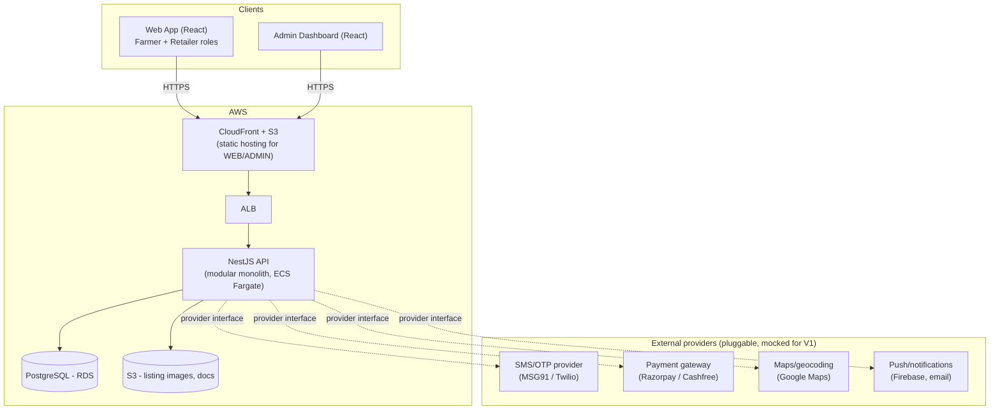

# System Architecture — Farmer-to-Retailer B2B Marketplace

Status: **Proposal — awaiting approval**
Owner: Mohammed Riyas
Last updated: 2026-09-22

## 1. What this system is

A B2B marketplace connecting **farmers** (sellers of produce) with **retailers** (buyers, e.g. kirana stores, small
wholesalers) operating in India. The platform is a **facilitator, not a merchant**:

- It never takes ownership of goods.
- It earns revenue via a **commission** on completed transactions, computed and enforced server-side.
- Payment is collected from the retailer through the payment gateway's own **marketplace/split-payment product**
  (Razorpay Route / Cashfree Easy Split style), which routes the farmer's share to their own linked account as a
  **held transfer** — never into the platform's own bank account — and **releases to the farmer only after
  pickup is confirmed and a short dispute window has passed** — this gives the marketplace an escrow-like trust
  mechanism without needing to run logistics, and without the platform ever taking custody of a transaction that
  isn't its own. See `docs/decisions/ADR-0005-payment-payout-model.md`.
- Fulfilment starts as **pickup-only** (farmer's location or an agreed point). Third-party delivery is an
  interface we design for but do not build in V1.

V1 scope (per current direction): **responsive web app**, not native mobile. Two customer-facing surfaces (farmer,
retailer) plus an internal admin dashboard, all backed by one NestJS API.

## 2. Design principles

1. **Modular monolith, not microservices.** One deployable backend service, organized into strongly-bounded
   modules with explicit interfaces between them. This is a small team / early-stage product — the operational
   cost of microservices (service discovery, distributed transactions, N deploy pipelines) isn't worth it yet.
   Module boundaries are drawn so that any module *could* be extracted into its own service later without a
   rewrite (no module reaches into another module's database tables directly — only through its service class).
2. **Server-side source of truth for money.** Commission rates, commission amounts, order totals and payout
   amounts are always computed and stored on the server at the moment they're locked in (e.g. at order
   confirmation). Clients never send a price/commission the server trusts blindly.
3. **Pluggable providers everywhere external.** SMS/OTP delivery, payment gateway, file storage, maps/geocoding,
   and push/notification delivery are each defined as a small TypeScript interface with a **Mock implementation**
   used in dev/MVP, so the system is fully runnable and testable without any real vendor account. Swapping in
   Razorpay/Cashfree/MSG91/Firebase/S3 later is a matter of writing one adapter class and changing config — no
   changes to business logic.
4. **Explicit state machines for anything with a lifecycle.** Negotiations and Orders are modeled as finite state
   machines with an explicit transition table, validated server-side. No status field is ever set by ad-hoc
   string assignment.
5. **Lean over complete.** We are not building slab-based tax engines, multi-warehouse inventory, or ML-based
   matching in V1. The matching engine is a scored filter/sort, not a recommender system. See `docs/decisions/`
   for the specific things we're deliberately deferring.

## 3. High-level component diagram



## 4. Backend module map

Each module owns its own database tables and exposes a service-layer API to other modules — no cross-module raw
SQL/ORM queries.

| Module | Responsibility |
|---|---|
| `auth` | Login/signup OTP request/verify (`otp_challenges`, purpose-restricted to `SIGNUP`/`LOGIN`), JWT issuance & refresh, role guards, session/device tracking. Structurally separate from the pickup handover code in `orders` — see below |
| `users` | Core `User` identity, role (`FARMER` \| `RETAILER` \| `ADMIN`), profile completeness/KYC status |
| `farmer-profile` | Farmer-specific data: farm location, bank/UPI payout details, verification status |
| `retailer-profile` | Retailer-specific data: business name, business location, GSTIN (optional at MVP) |
| `catalog` | Produce categories, units of measure, listings (crop, quantity, price/unit, quality grade, images, availability window). Serializes only a **coarse** location (`display_lat`/`display_lng`) on every public/browse and negotiation-facing endpoint — the farmer's exact pickup address is never returned here, see §5.1 |
| `matching` | Stateless query/scoring service: given a retailer's filters, rank active listings (distance, price, freshness) |
| `negotiation` | Offer / counter-offer thread on a listing between one farmer and one retailer; negotiation state machine |
| `orders` | Order creation from an accepted negotiation; order state machine, including the payout hold window; pickup scheduling & confirmation via its own **pickup handover code** (`pickup_handover_codes`, order-scoped, structurally separate from auth OTP — see §5.1); exposes the order's **exact** pickup address only to that order's two participants |
| `commission` | Commission rule configuration (admin-managed); computes & snapshots commission on order confirmation; commission ledger |
| `payments` | Split-payment creation with an on-hold farmer transfer, gateway webhook handling, payment status and reconciliation fields; releases/reduces/reverses the held transfer via the provider interface once the order state machine says to |
| `disputes` | Raise/track/resolve disputes tied to an order; resolution actions (refund, partial refund, release, reject) |
| `notifications` | Domain-event listener → fan-out to SMS/push/email via provider interface; per-user notification log |
| `admin` | Cross-module read/write APIs for the admin dashboard: user verification, listing moderation, commission config, dispute queue, platform metrics |

Modules communicate either via direct service injection (synchronous, in-process — e.g. `orders` calling
`commission.calculateFor(order)`) or via an in-process **domain event bus** (NestJS `EventEmitter2`) for anything
that should stay decoupled — notifications is the main consumer of events (`OfferReceived`, `OrderConfirmed`,
`PaymentCaptured`, `PickupConfirmed`, `DisputeRaised`, `PayoutProcessed`, etc.). This event bus is the seam where
a future extraction into a real message queue (SQS/SNS) would happen, without touching the publishers.

## 5. Provider interfaces (pluggable)

All defined in `apps/api/src/providers/*` as TypeScript interfaces with DI tokens, so NestJS can bind a different
implementation per environment via config, with zero call-site changes.

### 5.1 Two structurally separate "code" mechanisms

It's worth calling out explicitly, since it's easy to conflate: **login/signup OTP** (`auth` module,
`otp_challenges` table, `SmsProvider`) and the **pickup handover code** (`orders` module,
`pickup_handover_codes` table) share the same *shape* — a short hashed code with an expiry and attempt limit —
but are otherwise independent systems. Different table, different endpoints, different TTL policy, and a pickup
code is scoped to one `order_id` rather than a phone number. Verifying a pickup code never touches `auth` and
never issues a token — it only calls into `orders`' own state-transition logic. This separation is deliberate:
it makes it structurally impossible for a pickup code to be replayed as a login credential, rather than relying
on every call site remembering to filter by a shared `purpose` column correctly.

```ts
interface SmsProvider {
  // used only by `auth` for login/signup OTP delivery
  sendOtp(phoneE164: string, otp: string): Promise<void>;
  // used by `orders` to read the pickup handover code aloud to the farmer via SMS as a backup to in-app display
  sendPickupCode(phoneE164: string, code: string, orderId: string): Promise<void>;
}

interface PaymentGatewayProvider {
  // Farmer onboarding — required before an order can be confirmed for that farmer, not before they can list.
  createLinkedAccount(farmer: FarmerLinkedAccountInput): Promise<{ linkedAccountId: string; status: LinkedAccountStatus }>;
  getLinkedAccountStatus(linkedAccountId: string): Promise<LinkedAccountStatus>;

  // Split payment: creates a gateway "order" with an on-hold transfer routing payoutAmount to the farmer's
  // linked account. The commission share is implicitly what's retained by the platform's own account.
  // holdCeiling: the outer bound we're willing to commit to up front. Required for the Cashfree adapter
  // (maps to settlementEligibilityDate/max_eligibity_date, hard-capped by the provider at 45 days — see
  // docs/decisions/provider-capabilities-payment-split.md §3); the Razorpay adapter can ignore it or use it
  // as an initial on_hold_until, since Razorpay has no real ceiling and lets us extend later anyway.
  createSplitPayment(input: SplitPaymentInput & { holdCeiling: Date }): Promise<{ providerOrderId: string; clientPayload: unknown }>;

  verifyWebhookSignature(rawBody: Buffer, signature: string): boolean;
  parseWebhookEvent(rawBody: Buffer): PaymentWebhookEvent;

  // Transfer lifecycle — all act on the held transfer created by createSplitPayment, never on a new payout.
  // releaseTransfer only TRIGGERS release — it does not itself mean the farmer has been paid. Both candidate
  // providers confirm a separate, later settlement signal (see provider-capabilities-payment-split.md §6);
  // callers must wait for parseWebhookEvent to report a settlement-confirmed event before treating the payout
  // as final. Confirmed reliable on Razorpay; Cashfree's exact mechanism/event names are unconfirmed — §9.
  releaseTransfer(providerTransferId: string): Promise<TransferResult>;
  reduceTransfer(providerTransferId: string, newAmount: number): Promise<TransferResult>; // partial refund — Razorpay confirmed, Cashfree unconfirmed (§4)
  reverseTransfer(providerTransferId: string): Promise<TransferResult>; // full refund — Razorpay confirmed, Cashfree unconfirmed (§4)

  refundPayment(providerPaymentId: string, amount: number): Promise<RefundResult>;
}

interface StorageProvider {
  getUploadUrl(key: string, contentType: string): Promise<{ uploadUrl: string; publicUrl: string }>;
  delete(key: string): Promise<void>;
}

interface GeoProvider {
  // MVP: haversine distance from stored lat/lng, no external call needed.
  // Real Maps use (geocoding a free-text address, autocomplete) is opt-in and deferred.
  distanceKm(a: LatLng, b: LatLng): number;
  geocode?(address: string): Promise<LatLng>;
  // Derives the coarse point (docs/erd.md §3) stored as listings.display_lat/lng — a pure function, not
  // actually a network call, but kept on this interface since it's conceptually part of "geo handling".
  toDisplayPoint(exact: LatLng): LatLng;
}

interface NotificationChannel {
  // one per channel: SmsChannel, PushChannel, EmailChannel — all implement this
  send(userId: string, template: NotificationTemplate, data: Record<string, unknown>): Promise<void>;
}
```

V1 bindings: `MockSmsProvider` (writes codes to a `sms_log` table + server console — nothing sent),
`MockPaymentGatewayProvider` — deliberately simulates the *harder* of the two real providers' behavior, not the
easier one, per `docs/decisions/provider-capabilities-payment-split.md` §8: linked-account creation with a
configurable activation delay (default instant, but overridable per test), split-payment creation that respects
`holdCeiling`, a **two-phase** release with a configurable `RELEASED → SETTLED` lag (default a few seconds in
dev, configurable up to realistic values for testing the "released but not yet settled" dispute-race edge case),
an auto-release-at-ceiling behavior mirroring Cashfree's 45-day cap (scaled down for testing), and
reduce/reverse calls that can be made to fail on demand — so the whole hold-window, settlement-gate, and
ceiling-alert logic in `orders` is exercisable long before a real gateway account exists. `S3StorageProvider`
(real — S3 is cheap and gives us real pre-signed upload URLs from day one, no reason to mock), `GeoProvider` with
haversine + a simple rounding/grid-snap for `toDisplayPoint` (no Maps API key needed for V1),
`MockNotificationChannel` (logs to a table, surfaced in admin for now instead of an actual push/SMS/email send).

## 6. Frontend

- **`apps/web`** — one React + TypeScript app for both Farmer and Retailer. They share almost all primitives
  (auth, listing browse, negotiation thread, order tracking) and diverge only in a handful of screens (farmer:
  "my listings", "orders to fulfil"; retailer: "browse/search", "orders to receive"). Role-based routing after
  OTP login, shared component library, single deploy. Kept as one app deliberately — see ADR-0003.
- **`apps/admin`** — separate, smaller React app for internal ops/admin users. Kept separate from `apps/web` so
  it can be deployed to a distinct URL/subdomain, restricted by IP or SSO later, and never ships admin-only code
  to public bundles.
- **`packages/shared-types`** — DTOs, enums (order status, roles, etc.) generated/shared between `apps/api` and
  both frontends so the state machine and API contracts can't silently drift between backend and frontend.

## 7. Deployment topology (AWS)

Kept intentionally small for V1 — this is meant to run cheaply and simply, not to pre-optimize for scale we
don't have yet:

- **API**: single ECS Fargate service (1–2 tasks) behind an Application Load Balancer. Stateless — horizontal
  scale is just "add tasks" when needed.
- **Database**: RDS PostgreSQL, single instance (Multi-AZ can be turned on later without app changes).
- **Object storage**: S3 bucket for listing images and any dispute evidence uploads, served via CloudFront.
- **Frontends**: static builds of `apps/web` and `apps/admin`, each an S3 bucket + CloudFront distribution.
- **Secrets/config**: AWS Secrets Manager / SSM Parameter Store, injected as ECS task env vars.
- **CI/CD**: GitHub Actions — lint/test/build on PR, deploy to a single `staging` environment on merge to `main`
  (production promotion is a manual follow-up once we're past MVP validation).

No Kubernetes, no service mesh, no multi-region — all explicitly deferred.

## 8. Repo layout

```
farmer_to_retailer/
  apps/
    api/               # NestJS backend (modular monolith)
    web/               # React app — farmer + retailer
    admin/             # React app — admin/ops
  packages/
    shared-types/       # DTOs & enums shared across api/web/admin
  docs/
    architecture.md      # this file
    erd.md                # data model
    api-spec.md            # REST endpoint catalogue + openapi.yaml
    order-state-machine.md # negotiation & order lifecycles
    decisions/             # ADRs for things worth a deliberate call
  .github/workflows/        # CI
```

## 9. Build phases (as requested)

1. **Foundation** — repo/tooling, CI, NestJS skeleton, Postgres + migrations, config/env, provider interface
   scaffolding with mocks.
2. **Users** — OTP auth, roles, farmer/retailer profiles, admin user verification.
3. **Marketplace** — categories, listings, image upload, search/matching.
4. **Negotiation** — offer/counter-offer thread, negotiation state machine.
5. **Orders** — order creation from accepted negotiation, order state machine, pickup scheduling/confirmation.
6. **Payments** — commission engine, payment intents (mock gateway), payout on pickup confirmation.
7. **Disputes** — raise/track/resolve, refund/adjustment actions.
8. **Notifications** — domain events → notification log (mock channel), user-visible notification center.
9. **Admin dashboards** — verification queue, listing moderation, commission config, dispute queue, metrics.

Each phase should leave the system in a demoable state end-to-end (even if later phases are stubbed), rather than
building all backend before any frontend or vice versa.
