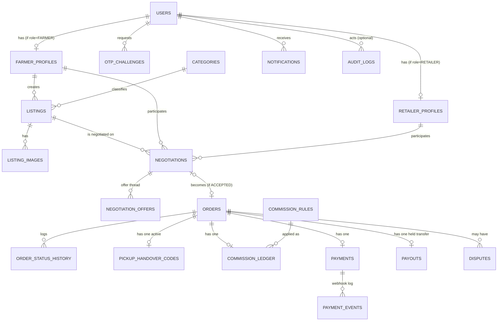

# Data Model / ERD — Farmer-to-Retailer Marketplace

Status: **Proposal — awaiting approval**

Conventions: every table has `id uuid primary key default gen_random_uuid()`, `created_at timestamptz default now()`,
and `updated_at timestamptz default now()` unless noted. Money columns are `numeric(12,2)` in INR. All enums are
Postgres enum types (or check constraints — TBD at implementation time, doesn't change the model).

## 1. Entity-relationship diagram

## 2. Table definitions

### `users`
Core identity for every actor (farmer, retailer, admin). Phone number is the login identifier.

| column | type | notes |
|---|---|---|
| phone_e164 | text, unique, not null | e.g. `+919812345678` |
| role | enum(`FARMER`,`RETAILER`,`ADMIN`) | fixed at signup |
| status | enum(`PENDING_VERIFICATION`,`ACTIVE`,`SUSPENDED`) | |
| last_login_at | timestamptz, nullable | |

### `otp_challenges`
**Login/signup only.** Every OTP request/verify attempt for authentication — never store the OTP in plaintext.
This table is deliberately *not* used for pickup handover (see `pickup_handover_codes` below) — the two are
structurally separate so a code generated for one purpose can never be used for the other.

| column | type | notes |
|---|---|---|
| user_id | uuid, nullable FK → users | null when OTP is for signup (user doesn't exist yet) |
| phone_e164 | text, not null | |
| purpose | enum(`SIGNUP`,`LOGIN`) | narrowed to auth only — see `pickup_handover_codes` for the handover flow |
| otp_hash | text, not null | bcrypt/argon2 hash, never plaintext |
| attempts | smallint, default 0 | max 5, then challenge is dead |
| expires_at | timestamptz, not null | 5 minutes from creation |
| consumed_at | timestamptz, nullable | set on successful verify |

### `farmer_profiles`
1:1 with `users` where `role = FARMER`.

| column | type | notes |
|---|---|---|
| user_id | uuid, unique FK → users | |
| full_name | text | |
| village, district, state, pincode | text | |
| lat, lng | double precision | exact farm location — used server-side for distance calc and to derive `listings.display_lat/lng`; never returned directly by a public API (see §3) |
| gateway_linked_account_id | text, nullable | the payment gateway's linked/sub-account id (Razorpay Route / Cashfree Easy Split) — required before this farmer can receive a payout, not before they can list or negotiate |
| gateway_linked_account_status | enum(`NOT_STARTED`,`PENDING`,`ACTIVE`,`REJECTED`) | gateway-side KYC status, independent of our own `verification_status` below |
| verification_status | enum(`UNVERIFIED`,`PENDING`,`VERIFIED`,`REJECTED`) | our own admin-gated verification, required before a farmer can list |
| verified_by_admin_id | uuid, nullable FK → users | |
| verified_at | timestamptz, nullable | |

*(The old `payout_method`/`upi_vpa`/`bank_account_number_enc`/`bank_ifsc` fields from the collect-then-payout
draft are removed — under the gateway marketplace/split model, bank/UPI details are collected and held by the
gateway as part of the farmer's linked-account onboarding, not stored by us. See ADR-0005.)*

### `retailer_profiles`
1:1 with `users` where `role = RETAILER`.

| column | type | notes |
|---|---|---|
| user_id | uuid, unique FK → users | |
| business_name, contact_name | text | |
| business_address | text | |
| lat, lng | double precision | |
| gstin | text, nullable | optional at MVP |
| verification_status | enum(`UNVERIFIED`,`PENDING`,`VERIFIED`,`REJECTED`) | |
| verified_by_admin_id, verified_at | | |

### `categories`
Admin-managed produce categories (onion, tomato, wheat, ...).

| column | type | notes |
|---|---|---|
| name | text, unique | |
| unit_of_measure | enum(`KG`,`QUINTAL`,`DOZEN`,`UNIT`) | default unit for the category |
| is_active | boolean, default true | |

### `listings`
A farmer's sellable batch of produce.

| column | type | notes |
|---|---|---|
| farmer_id | uuid FK → farmer_profiles | |
| category_id | uuid FK → categories | |
| crop_name, variety | text | variety nullable |
| quantity_available | numeric(12,2) | in the category's unit |
| unit | enum(`KG`,`QUINTAL`,`DOZEN`,`UNIT`) | |
| price_per_unit | numeric(12,2) | farmer's asking price — starting point for negotiation |
| quality_grade | enum(`A`,`B`,`C`), nullable | |
| harvest_date | date, nullable | |
| available_from, available_until | timestamptz | availability window |
| pickup_address | text | **exact** address — access-restricted, see §3. Defaults from the farmer's profile, editable per listing |
| pickup_lat, pickup_lng | double precision | **exact** coordinates — access-restricted, see §3 |
| display_lat, display_lng | double precision | **coarse** coordinates derived server-side from `pickup_lat/lng` (rounded to ~2 decimal degrees, roughly a 1km jitter/grid-snap) — this is what public/browse APIs and the matching engine's distance sort actually return |
| status | enum(`DRAFT`,`ACTIVE`,`PAUSED`,`SOLD_OUT`,`EXPIRED`,`REMOVED`) | |

### `listing_images`

| column | type | notes |
|---|---|---|
| listing_id | uuid FK → listings | |
| s3_key | text | |
| position | smallint | display order |

### `negotiations`
One negotiation = one farmer + one retailer discussing one listing.

| column | type | notes |
|---|---|---|
| listing_id | uuid FK → listings | |
| farmer_id | uuid FK → farmer_profiles | |
| retailer_id | uuid FK → retailer_profiles | |
| status | enum(`OPEN`,`ACCEPTED`,`REJECTED`,`EXPIRED`,`CANCELLED`) | see order-state-machine.md |
| initial_price_per_unit, initial_quantity | numeric | retailer's opening offer |
| final_price_per_unit, final_quantity | numeric, nullable | set when `ACCEPTED` |
| expires_at | timestamptz | auto-expire stale negotiations (e.g. 48h of inactivity) |

### `negotiation_offers`
Append-only thread of offers/counter-offers — never updated, only inserted.

| column | type | notes |
|---|---|---|
| negotiation_id | uuid FK → negotiations | |
| sender_role | enum(`FARMER`,`RETAILER`) | |
| price_per_unit, quantity | numeric | |
| message | text, nullable | |

### `orders`
Created only from an `ACCEPTED` negotiation — 1:1 with it.

| column | type | notes |
|---|---|---|
| negotiation_id | uuid, unique FK → negotiations | |
| listing_id | uuid FK → listings | denormalized for query convenience |
| farmer_id | uuid FK → farmer_profiles | |
| retailer_id | uuid FK → retailer_profiles | |
| quantity | numeric(12,2) | |
| price_per_unit | numeric(12,2) | from negotiation's final terms |
| subtotal_amount | numeric(12,2) | `quantity * price_per_unit` |
| commission_rate_snapshot | numeric(6,3) | % or flat, snapshotted at confirmation — see `commission_rules` |
| commission_amount | numeric(12,2) | computed once, immutable after |
| payout_amount | numeric(12,2) | `subtotal_amount - commission_amount` — the amount configured on the held gateway transfer |
| status | enum — see order-state-machine.md | |
| pickup_address | text | **exact** — copied from the listing at order creation; returned only to the two participants (see §3) |
| pickup_lat, pickup_lng | double precision | **exact** — same access restriction |
| pickup_scheduled_at | timestamptz, nullable | |
| pickup_confirmed_at | timestamptz, nullable | |
| payout_release_at | timestamptz, nullable | set at pickup confirmation = `pickup_confirmed_at + hold window` (default 48h, admin-configurable); the scheduled release job acts on this — see order-state-machine.md |
| cancelled_reason, cancelled_by | text / uuid, nullable | |

*(`pickup_otp_hash` from the earlier draft is removed — replaced by the dedicated `pickup_handover_codes` table
below.)*

### `pickup_handover_codes`
**New — separate from `otp_challenges` on purpose.** One row per generated handover code, scoped to a specific
order, not a phone number. Verifying one only ever transitions order state; it never issues an auth token.

| column | type | notes |
|---|---|---|
| order_id | uuid FK → orders | |
| code_hash | text, not null | hashed, never stored/logged in plaintext |
| attempts | smallint, default 0 | max 5 per active code |
| expires_at | timestamptz | independent TTL from login OTP — can be longer, since a farmer may mark ready hours before actual handover |
| generated_at | timestamptz | |
| confirmed_at | timestamptz, nullable | set when the retailer successfully verifies it |
| regenerated_count | smallint, default 0 | farmer can request a fresh code if the original expires or is lost; increments this and invalidates the previous code |

### `order_status_history`
Append-only audit trail of every state transition — required for disputes and support.

| column | type | notes |
|---|---|---|
| order_id | uuid FK → orders | |
| from_status, to_status | enum | |
| changed_by_user_id | uuid, nullable FK → users | null = system-initiated (e.g. webhook, expiry job, scheduled payout release) |
| reason | text, nullable | |

### `commission_rules`
Admin-configured. Resolved per category with a global fallback.

| column | type | notes |
|---|---|---|
| category_id | uuid, nullable FK → categories | null = global default rule |
| rule_type | enum(`PERCENTAGE`,`FLAT`) | |
| value | numeric(6,3) | percentage (e.g. `5.000` = 5%) or flat INR amount |
| min_amount, max_amount | numeric(12,2), nullable | caps, optional |
| effective_from, effective_to | timestamptz | effective_to null = currently active |
| created_by_admin_id | uuid FK → users | |

### `commission_ledger`
One row per order — snapshot of which rule was applied and the resulting amount, for accounting/reporting even
if `commission_rules` changes later.

| column | type | notes |
|---|---|---|
| order_id | uuid, unique FK → orders | |
| commission_rule_id | uuid FK → commission_rules | |
| rate_or_flat_applied | numeric | copy of the rule's value at the time |
| amount | numeric(12,2) | = `orders.commission_amount` |

### `payments`
1:1 with `orders`. The retailer's payment, created as a split payment with an on-hold transfer to the farmer
(see ADR-0005). Reconciliation fields strengthened so a finance review never has to go to the gateway dashboard
to answer "did this actually settle, and for how much."

| column | type | notes |
|---|---|---|
| order_id | uuid, unique FK → orders | |
| provider | enum(`MOCK`,`RAZORPAY`,`CASHFREE`) | |
| provider_order_id | text | gateway's "order" object id — created at `PENDING_PAYMENT`, carries the `transfers[]`/split spec |
| provider_payment_id | text, nullable | the actual payment/transaction id, set once the retailer pays |
| method | enum(`UPI`,`CARD`,`NETBANKING`,`WALLET`,`OTHER`), nullable | populated from the gateway's response on capture |
| currency | text, default `INR` | |
| authorized_amount | numeric(12,2), nullable | |
| captured_amount | numeric(12,2), nullable | |
| fee_amount | numeric(12,2), nullable | gateway's fee on this payment |
| tax_amount | numeric(12,2), nullable | GST on the gateway fee |
| net_amount | numeric(12,2), nullable | `captured_amount - fee_amount - tax_amount` — what actually lands in the platform's settlement for its commission share |
| refunded_amount | numeric(12,2), default 0 | cumulative — supports multiple partial refunds |
| settlement_id | text, nullable | gateway's settlement batch id, once it lands |
| settlement_utr | text, nullable | bank UTR for the settlement — the field finance actually reconciles against |
| status | enum(`CREATED`,`AUTHORIZED`,`CAPTURED`,`FAILED`,`REFUNDED`,`PARTIALLY_REFUNDED`) | |
| reconciliation_status | enum(`UNRECONCILED`,`RECONCILED`,`MISMATCH`), default `UNRECONCILED` | set by a reconciliation job comparing our records to the gateway's settlement report |
| reconciled_at | timestamptz, nullable | |
| captured_at | timestamptz, nullable | |
| failure_reason | text, nullable | |

### `payment_events`
Raw webhook audit log — never trust a webhook you can't replay/inspect later.

| column | type | notes |
|---|---|---|
| payment_id | uuid FK → payments | |
| event_type | text | e.g. `payment.captured` |
| raw_payload | jsonb | |
| received_at | timestamptz | |

### `payouts`
1:1 with `orders`. Represents the gateway's held **split transfer** to the farmer's linked account — created
alongside the payment at `PENDING_PAYMENT` with `on_hold = true`, released only per the order state machine's
hold-window logic.

| column | type | notes |
|---|---|---|
| order_id | uuid, unique FK → orders | |
| farmer_id | uuid FK → farmer_profiles | |
| provider | enum(`MOCK`,`RAZORPAY`,`CASHFREE`) | |
| provider_transfer_id | text | the gateway's Route/Split transfer id |
| linked_account_id | text | copy of `farmer_profiles.gateway_linked_account_id` **at transfer creation time** — deliberately denormalized so a later change to the farmer's linked account never retroactively alters a historical transfer's record |
| amount | numeric(12,2) | = `orders.payout_amount` at creation |
| on_hold | boolean, default true | |
| hold_release_at | timestamptz | mirrors `orders.payout_release_at` |
| released_at | timestamptz, nullable | set when the gateway confirms release |
| reversed_amount | numeric(12,2), default 0 | cumulative — set on dispute-driven reversal/reduction, always happens pre-release |
| fee_amount | numeric(12,2), nullable | gateway's transfer fee, if any |
| utr | text, nullable | bank UTR once the transfer settles from the linked account to the farmer's bank/UPI, if the gateway surfaces it |
| status | enum(`ON_HOLD`,`RELEASED`,`REVERSED`,`PARTIALLY_REVERSED`,`FAILED`) | |
| reconciliation_status | enum(`UNRECONCILED`,`RECONCILED`,`MISMATCH`), default `UNRECONCILED` | |
| reconciled_at | timestamptz, nullable | |
| failure_reason | text, nullable | |

### `disputes`

| column | type | notes |
|---|---|---|
| order_id | uuid FK → orders | |
| raised_by_user_id | uuid FK → users | |
| raised_by_role | enum(`FARMER`,`RETAILER`) | |
| category | enum(`QUALITY`,`QUANTITY`,`NO_SHOW`,`PAYMENT`,`OTHER`) | |
| description | text | |
| evidence_s3_keys | jsonb (text[]) | photos uploaded as evidence |
| status | enum(`OPEN`,`UNDER_REVIEW`,`RESOLVED_REFUND`,`RESOLVED_PARTIAL_REFUND`,`RESOLVED_NO_ACTION`,`REJECTED`) | |
| resolution_notes | text, nullable | |
| resolved_by_admin_id | uuid, nullable FK → users | |
| resolved_at | timestamptz, nullable | |

### `notifications`
Per-user notification log — also the "outbox" the notification channels read from.

| column | type | notes |
|---|---|---|
| user_id | uuid FK → users | |
| type | text | domain event name, e.g. `ORDER_CONFIRMED` |
| title, body | text | |
| data | jsonb | e.g. `{ orderId }` for deep-linking |
| channel | enum(`SMS`,`PUSH`,`EMAIL`,`IN_APP`) | |
| status | enum(`PENDING`,`SENT`,`FAILED`) | |
| read_at | timestamptz, nullable | for IN_APP |

### `audit_logs`
General admin/system action trail (verification decisions, dispute resolutions, manual overrides).

| column | type | notes |
|---|---|---|
| actor_user_id | uuid, nullable FK → users | null = system |
| action | text | e.g. `FARMER_VERIFIED`, `DISPUTE_RESOLVED` |
| entity_type, entity_id | text / uuid | polymorphic reference |
| before, after | jsonb, nullable | state diff where useful |

## 3. Location-privacy boundary (exact vs. coarse)

A farmer's exact pickup location is meaningful personal/safety information and must not be exposed to anyone
who hasn't actually transacted with that farmer. The rule, enforced at the API-serializer level (see
`docs/api-spec.md`):

- **Public/browse endpoints** (`GET /listings`, `GET /listings/:id`) and **negotiation endpoints**
  (`GET /negotiations`, `GET /negotiations/:id`) serialize `listings.display_lat`/`display_lng` (coarse, ~1km) —
  and a village/district text label — **never** `pickup_address`/`pickup_lat`/`pickup_lng`.
- **`orders.pickup_address`/`pickup_lat`/`pickup_lng`** (copied from the listing at order-creation time) are
  serialized **only** by `GET /orders/:id`, and only to that order's two participants (the specific farmer and
  retailer) or an admin — never to any other authenticated user, and never unauthenticated.
- This means a retailer only learns a farmer's exact pickup location once they've actually committed to a deal
  (negotiation accepted → order created), not while merely browsing or negotiating. That's an intentional
  trust/safety tradeoff, not an oversight — it costs the retailer nothing (they still get accurate
  distance/sorting via `display_lat/lng` during browse), while meaningfully reducing exposure of a farmer's home
  or farm location to anonymous or not-yet-committed users.

## 4. Notes on a few other deliberate choices

- **No `admin_profiles` table** — an admin is just a `users` row with `role = ADMIN`. Fine-grained permission
  tiers can be added later if/when the admin team grows past "founder + a couple of ops people."
- **`commission_rate_snapshot`/`commission_amount` live on `orders` *and* get a `commission_ledger` row** — this
  looks redundant but isn't: the columns on `orders` make the hot-path order queries fast (no join needed to show
  a farmer their payout), while `commission_ledger` is the accounting-grade record tied to the rule that produced
  it, for admin reporting and audits.
- **Pickup handover uses its own table (`pickup_handover_codes`), not `otp_challenges`** — see §2 and
  `docs/order-state-machine.md` for why: it keeps the auth OTP system and the pickup-confirmation system
  structurally incapable of being confused with each other, rather than relying on everyone remembering to
  filter by `purpose` correctly forever.
