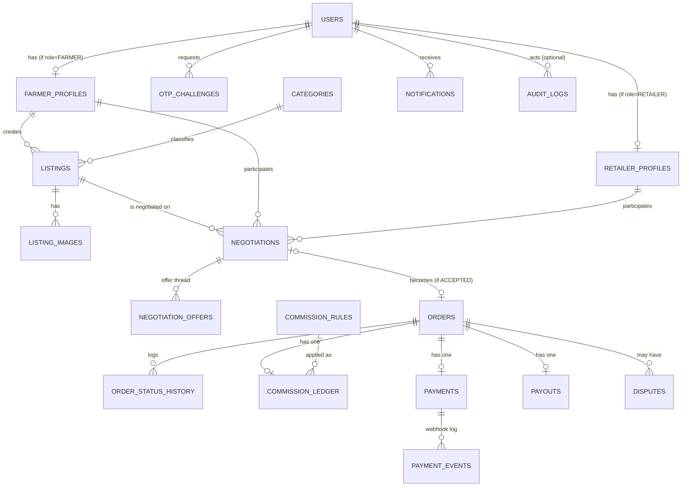

# Data Model / ERD — Farmer-to-Retailer Marketplace

Status: **Proposal — awaiting approval**

Conventions: every table has `id uuid primary key default gen_random_uuid()`, `created_at timestamptz default now()`,
and `updated_at timestamptz default now()` unless noted. Money columns are `numeric(12,2)` in INR. All enums are
Postgres enum types (or check constraints — TBD at implementation time, doesn't change the model).

## 1. Entity-relationship diagram

## 2. Table definitions

### `users`
Core identity for every actor (farmer, retailer, admin). Phone number is the login identifier.

| column | type | notes |
|---|---|---|
| phone_e164 | text, unique, not null | e.g. `+919812345678` |
| role | enum(`FARMER`,`RETAILER`,`ADMIN`) | fixed at signup |
| status | enum(`PENDING_VERIFICATION`,`ACTIVE`,`SUSPENDED`) | |
| last_login_at | timestamptz, nullable | |

### `otp_challenges`
Every OTP request/verify attempt — never store the OTP in plaintext.

| column | type | notes |
|---|---|---|
| user_id | uuid, nullable FK → users | null when OTP is for signup (user doesn't exist yet) |
| phone_e164 | text, not null | |
| purpose | enum(`SIGNUP`,`LOGIN`,`PICKUP_CONFIRM`) | pickup confirmation reuses the OTP mechanism (see order-state-machine.md) |
| otp_hash | text, not null | bcrypt/argon2 hash, never plaintext |
| attempts | smallint, default 0 | max 5, then challenge is dead |
| expires_at | timestamptz, not null | 5 minutes from creation |
| consumed_at | timestamptz, nullable | set on successful verify |

### `farmer_profiles`
1:1 with `users` where `role = FARMER`.

| column | type | notes |
|---|---|---|
| user_id | uuid, unique FK → users | |
| full_name | text | |
| village, district, state, pincode | text | |
| lat, lng | double precision | for matching/distance |
| payout_method | enum(`UPI`,`BANK`) | |
| upi_vpa | text, nullable | |
| bank_account_number_enc, bank_ifsc | text, nullable | encrypted at rest |
| verification_status | enum(`UNVERIFIED`,`PENDING`,`VERIFIED`,`REJECTED`) | admin-gated before a farmer can list |
| verified_by_admin_id | uuid, nullable FK → users | |
| verified_at | timestamptz, nullable | |

### `retailer_profiles`
1:1 with `users` where `role = RETAILER`.

| column | type | notes |
|---|---|---|
| user_id | uuid, unique FK → users | |
| business_name, contact_name | text | |
| business_address | text | |
| lat, lng | double precision | |
| gstin | text, nullable | optional at MVP |
| verification_status | enum(`UNVERIFIED`,`PENDING`,`VERIFIED`,`REJECTED`) | |
| verified_by_admin_id, verified_at | | |

### `categories`
Admin-managed produce categories (onion, tomato, wheat, ...).

| column | type | notes |
|---|---|---|
| name | text, unique | |
| unit_of_measure | enum(`KG`,`QUINTAL`,`DOZEN`,`UNIT`) | default unit for the category |
| is_active | boolean, default true | |

### `listings`
A farmer's sellable batch of produce.

| column | type | notes |
|---|---|---|
| farmer_id | uuid FK → farmer_profiles | |
| category_id | uuid FK → categories | |
| crop_name, variety | text | variety nullable |
| quantity_available | numeric(12,2) | in the category's unit |
| unit | enum(`KG`,`QUINTAL`,`DOZEN`,`UNIT`) | |
| price_per_unit | numeric(12,2) | farmer's asking price — starting point for negotiation |
| quality_grade | enum(`A`,`B`,`C`), nullable | |
| harvest_date | date, nullable | |
| available_from, available_until | timestamptz | availability window |
| pickup_address, pickup_lat, pickup_lng | text / double precision | defaults to farmer's location, editable per listing |
| status | enum(`DRAFT`,`ACTIVE`,`PAUSED`,`SOLD_OUT`,`EXPIRED`,`REMOVED`) | |

### `listing_images`

| column | type | notes |
|---|---|---|
| listing_id | uuid FK → listings | |
| s3_key | text | |
| position | smallint | display order |

### `negotiations`
One negotiation = one farmer + one retailer discussing one listing.

| column | type | notes |
|---|---|---|
| listing_id | uuid FK → listings | |
| farmer_id | uuid FK → farmer_profiles | |
| retailer_id | uuid FK → retailer_profiles | |
| status | enum(`OPEN`,`ACCEPTED`,`REJECTED`,`EXPIRED`,`CANCELLED`) | see order-state-machine.md |
| initial_price_per_unit, initial_quantity | numeric | retailer's opening offer |
| final_price_per_unit, final_quantity | numeric, nullable | set when `ACCEPTED` |
| expires_at | timestamptz | auto-expire stale negotiations (e.g. 48h of inactivity) |

### `negotiation_offers`
Append-only thread of offers/counter-offers — never updated, only inserted.

| column | type | notes |
|---|---|---|
| negotiation_id | uuid FK → negotiations | |
| sender_role | enum(`FARMER`,`RETAILER`) | |
| price_per_unit, quantity | numeric | |
| message | text, nullable | |

### `orders`
Created only from an `ACCEPTED` negotiation — 1:1 with it.

| column | type | notes |
|---|---|---|
| negotiation_id | uuid, unique FK → negotiations | |
| listing_id | uuid FK → listings | denormalized for query convenience |
| farmer_id | uuid FK → farmer_profiles | |
| retailer_id | uuid FK → retailer_profiles | |
| quantity | numeric(12,2) | |
| price_per_unit | numeric(12,2) | from negotiation's final terms |
| subtotal_amount | numeric(12,2) | `quantity * price_per_unit` |
| commission_rate_snapshot | numeric(6,3) | % or flat, snapshotted at confirmation — see `commission_rules` |
| commission_amount | numeric(12,2) | computed once, immutable after |
| payout_amount | numeric(12,2) | `subtotal_amount - commission_amount` |
| status | enum — see order-state-machine.md | |
| pickup_address, pickup_lat, pickup_lng | | copied from listing, editable |
| pickup_scheduled_at | timestamptz, nullable | |
| pickup_confirmed_at | timestamptz, nullable | |
| pickup_otp_hash | text, nullable | shared handover OTP — see below |
| cancelled_reason, cancelled_by | text / uuid, nullable | |

### `order_status_history`
Append-only audit trail of every state transition — required for disputes and support.

| column | type | notes |
|---|---|---|
| order_id | uuid FK → orders | |
| from_status, to_status | enum | |
| changed_by_user_id | uuid, nullable FK → users | null = system-initiated (e.g. webhook, expiry job) |
| reason | text, nullable | |

### `commission_rules`
Admin-configured. Resolved per category with a global fallback.

| column | type | notes |
|---|---|---|
| category_id | uuid, nullable FK → categories | null = global default rule |
| rule_type | enum(`PERCENTAGE`,`FLAT`) | |
| value | numeric(6,3) | percentage (e.g. `5.000` = 5%) or flat INR amount |
| min_amount, max_amount | numeric(12,2), nullable | caps, optional |
| effective_from, effective_to | timestamptz | effective_to null = currently active |
| created_by_admin_id | uuid FK → users | |

### `commission_ledger`
One row per order — snapshot of which rule was applied and the resulting amount, for accounting/reporting even
if `commission_rules` changes later.

| column | type | notes |
|---|---|---|
| order_id | uuid, unique FK → orders | |
| commission_rule_id | uuid FK → commission_rules | |
| rate_or_flat_applied | numeric | copy of the rule's value at the time |
| amount | numeric(12,2) | = `orders.commission_amount` |

### `payments`
1:1 with `orders`. The retailer's payment into the platform.

| column | type | notes |
|---|---|---|
| order_id | uuid, unique FK → orders | |
| provider | enum(`MOCK`,`RAZORPAY`,`CASHFREE`) | |
| provider_payment_intent_id | text | gateway's order/intent id |
| amount, currency | numeric / text | currency default `INR` |
| status | enum(`CREATED`,`AUTHORIZED`,`CAPTURED`,`FAILED`,`REFUNDED`,`PARTIALLY_REFUNDED`) | |
| captured_at | timestamptz, nullable | |
| failure_reason | text, nullable | |

### `payment_events`
Raw webhook audit log — never trust a webhook you can't replay/inspect later.

| column | type | notes |
|---|---|---|
| payment_id | uuid FK → payments | |
| event_type | text | e.g. `payment.captured` |
| raw_payload | jsonb | |
| received_at | timestamptz | |

### `payouts`
1:1 with `orders`. Platform → farmer, triggered only after pickup confirmation.

| column | type | notes |
|---|---|---|
| order_id | uuid, unique FK → orders | |
| farmer_id | uuid FK → farmer_profiles | |
| provider | enum(`MOCK`,`RAZORPAY`,`CASHFREE`) | |
| provider_payout_id | text, nullable | |
| amount | numeric(12,2) | = `orders.payout_amount` |
| status | enum(`PENDING`,`PROCESSING`,`SETTLED`,`FAILED`) | |
| failure_reason | text, nullable | |
| initiated_at, settled_at | timestamptz | |

### `disputes`

| column | type | notes |
|---|---|---|
| order_id | uuid FK → orders | |
| raised_by_user_id | uuid FK → users | |
| raised_by_role | enum(`FARMER`,`RETAILER`) | |
| category | enum(`QUALITY`,`QUANTITY`,`NO_SHOW`,`PAYMENT`,`OTHER`) | |
| description | text | |
| evidence_s3_keys | jsonb (text[]) | photos uploaded as evidence |
| status | enum(`OPEN`,`UNDER_REVIEW`,`RESOLVED_REFUND`,`RESOLVED_PARTIAL_REFUND`,`RESOLVED_NO_ACTION`,`REJECTED`) | |
| resolution_notes | text, nullable | |
| resolved_by_admin_id | uuid, nullable FK → users | |
| resolved_at | timestamptz, nullable | |

### `notifications`
Per-user notification log — also the "outbox" the notification channels read from.

| column | type | notes |
|---|---|---|
| user_id | uuid FK → users | |
| type | text | domain event name, e.g. `ORDER_CONFIRMED` |
| title, body | text | |
| data | jsonb | e.g. `{ orderId }` for deep-linking |
| channel | enum(`SMS`,`PUSH`,`EMAIL`,`IN_APP`) | |
| status | enum(`PENDING`,`SENT`,`FAILED`) | |
| read_at | timestamptz, nullable | for IN_APP |

### `audit_logs`
General admin/system action trail (verification decisions, dispute resolutions, manual overrides).

| column | type | notes |
|---|---|---|
| actor_user_id | uuid, nullable FK → users | null = system |
| action | text | e.g. `FARMER_VERIFIED`, `DISPUTE_RESOLVED` |
| entity_type, entity_id | text / uuid | polymorphic reference |
| before, after | jsonb, nullable | state diff where useful |

## 3. Notes on a few deliberate choices

- **No `admin_profiles` table** — an admin is just a `users` row with `role = ADMIN`. Fine-grained permission
  tiers can be added later if/when the admin team grows past "founder + a couple of ops people."
- **`commission_rate_snapshot`/`commission_amount` live on `orders` *and* get a `commission_ledger` row** — this
  looks redundant but isn't: the columns on `orders` make the hot-path order queries fast (no join needed to show
  a farmer their payout), while `commission_ledger` is the accounting-grade record tied to the rule that produced
  it, for admin reporting and audits.
- **Pickup handover OTP lives on `orders.pickup_otp_hash`**, reusing the same OTP mechanism as login rather than
  inventing a second one — see `docs/order-state-machine.md` for how it's used to confirm handover without any
  logistics/delivery infrastructure.
