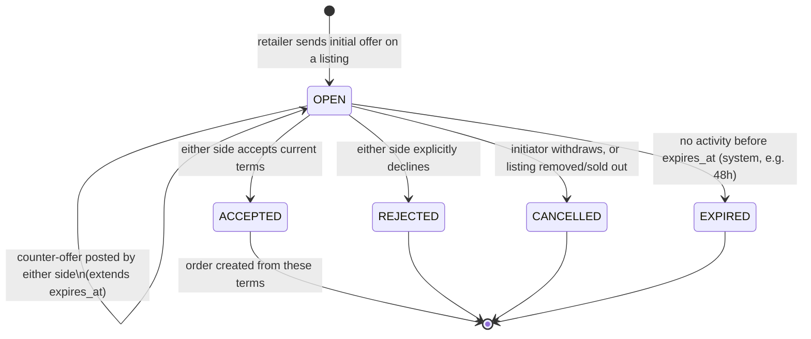
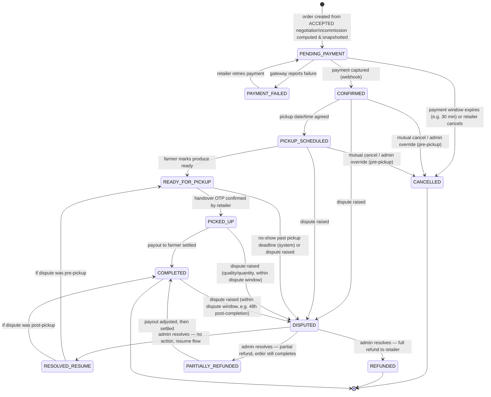

# Negotiation & Order State Machines

Status: **Proposal — awaiting approval**

Both machines are enforced **server-side only** — `orders.status` and `negotiations.status` are never set directly
from client input; every transition goes through a service method that checks the current state, the actor's role,
and any guard conditions, and writes an `order_status_history` row in the same DB transaction as the status change.

## 1. Negotiation lifecycle

A negotiation is one farmer + one retailer discussing terms on one listing. It exists to produce, at most, one
`order`.

| From | Event | To | Who | Side effects |
|---|---|---|---|---|
| — | Retailer opens negotiation on an active listing | `OPEN` | retailer | `negotiation_offers` row #1; `OfferReceived` event → notify farmer |
| `OPEN` | Counter-offer (price/quantity) | `OPEN` | farmer or retailer | new `negotiation_offers` row; `expires_at` pushed out; notify the other side |
| `OPEN` | Accept current terms | `ACCEPTED` | farmer or retailer (whoever didn't post the last offer) | `final_price_per_unit`/`final_quantity` set; `NegotiationAccepted` event → **creates an `order`** (see below) |
| `OPEN` | Reject | `REJECTED` | farmer or retailer | notify other side |
| `OPEN` | Cancel | `CANCELLED` | the offer's own initiator, or system if listing is removed | notify other side |
| `OPEN` | Expiry sweep | `EXPIRED` | system (scheduled job) | notify both sides |

**Guard:** a listing can have many *concurrent* `OPEN` negotiations with different retailers (first-come pricing
isn't decided by the platform). The moment one negotiation reaches `ACCEPTED` for a quantity that exhausts the
listing, the farmer's remaining open negotiations on that listing are auto-`CANCELLED` with a clear reason
(`listing_sold_out`) rather than left to expire — this is a service-layer rule in `negotiation`, not a raw status
flip.

## 2. Order lifecycle

Created the instant a negotiation is `ACCEPTED`. This is the core trust-and-money state machine.

*(`RESOLVED_RESUME` is a transient routing state, not stored distinctly if that's simpler in practice — the
implementation can instead resume directly to the correct concrete state from `DISPUTED`. Modeled explicitly here
so the "which state do we resume to" question isn't hand-waved.)*

### Transition table

| From | Event | To | Who | Side effects |
|---|---|---|---|---|
| — | Negotiation accepted | `PENDING_PAYMENT` | system | order row created; `commission_rate_snapshot`/`commission_amount`/`payout_amount` computed via `commission` module and frozen; payment intent created with gateway provider; `OrderCreated` event |
| `PENDING_PAYMENT` | Gateway webhook: payment failed | `PAYMENT_FAILED` | system (webhook) | notify retailer with retry link |
| `PAYMENT_FAILED` | Retailer retries | `PENDING_PAYMENT` | retailer | new payment intent |
| `PENDING_PAYMENT` | Payment window expires / retailer cancels | `CANCELLED` | system or retailer | `cancelled_reason` set; listing quantity released back if reserved; notify farmer |
| `PENDING_PAYMENT` | Gateway webhook: payment captured | `CONFIRMED` | system (webhook) | `payments.status = CAPTURED`; `OrderConfirmed` event → notify both sides |
| `CONFIRMED` | Pickup slot agreed | `PICKUP_SCHEDULED` | farmer or retailer (either proposes, other confirms — simple mutual-agreement field, not a sub-workflow) | `pickup_scheduled_at` set; notify both |
| `PICKUP_SCHEDULED` | Farmer marks ready | `READY_FOR_PICKUP` | farmer | system generates & hashes the handover OTP, sends the plaintext OTP to the **farmer only**; notify retailer "ready for pickup" |
| `READY_FOR_PICKUP` | Retailer enters handover OTP (read aloud by farmer at physical handover) | `PICKED_UP` | retailer | `pickup_confirmed_at` set; `order_status_history` records who confirmed; `PickupConfirmed` event → triggers payout initiation |
| `PICKED_UP` | Payout settles | `COMPLETED` | system (payout provider callback) | `payouts.status = SETTLED`; `PayoutProcessed` event → notify farmer |
| `CONFIRMED` / `PICKUP_SCHEDULED` | Mutual cancel or admin override | `CANCELLED` | farmer+retailer agreement, or admin | refund initiated on captured payment; reason logged |
| `READY_FOR_PICKUP` | Pickup deadline passes with no `PICKED_UP` | `DISPUTED` (category `NO_SHOW`) | system (scheduled job) | auto-opens a dispute rather than silently cancelling, so a human decides the refund — money is already captured |
| `CONFIRMED`..`COMPLETED` | Either party raises a dispute (within the allowed window) | `DISPUTED` | farmer or retailer | payout is **blocked** while `DISPUTED`; admin notified |
| `DISPUTED` | Admin resolves: no issue found | back to prior stage (`READY_FOR_PICKUP` if pre-pickup, `COMPLETED` if post-pickup) | admin | resumes normal flow |
| `DISPUTED` | Admin resolves: full refund | `REFUNDED` | admin | refund via `payments` provider; payout cancelled/never initiated |
| `DISPUTED` | Admin resolves: partial refund | `PARTIALLY_REFUNDED` → `COMPLETED` | admin | `payout_amount` reduced by refund amount before payout is initiated |

### Notes

- **Commission is frozen at `PENDING_PAYMENT` creation**, not at `COMPLETED`. This means a mid-flight change to
  `commission_rules` never affects an order already in progress — the amount printed to the retailer at checkout
  is the amount that's actually charged and settled.
- **Payout never fires before `PICKED_UP`.** This is the core trust guarantee of the marketplace: the platform
  holds the retailer's payment from `CONFIRMED` through `PICKED_UP`, so a retailer who never shows up hasn't
  paid a farmer for nothing, and a farmer who confirms pickup has a guaranteed payout in motion.
- **Cancellation policy (who can cancel when, any penalty) is deliberately left as an admin-configurable rule,
  not hardcoded** — see `docs/decisions/ADR-0004-cancellation-refund-policy.md`. The state machine above supports
  cancellation at any pre-pickup state; the *business rule* for whether that's free, partially penalized, etc.
  is out of scope for V1 and defaults to "admin decides case-by-case."
- **Pickup handover OTP reuses the same OTP infrastructure as login** (`otp_challenges` with
  `purpose = PICKUP_CONFIRM`), just scoped to a specific order rather than a login session.
