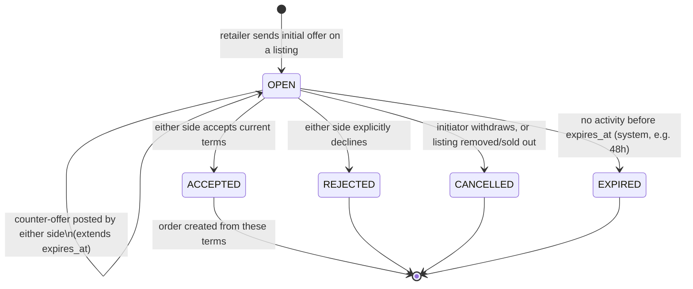

# Negotiation & Order State Machines

Status: **Proposal — awaiting approval**

Both machines are enforced **server-side only** — `orders.status` and `negotiations.status` are never set directly
from client input; every transition goes through a service method that checks the current state, the actor's role,
and any guard conditions, and writes an `order_status_history` row in the same DB transaction as the status change.

## 1. Negotiation lifecycle

A negotiation is one farmer + one retailer discussing terms on one listing. It exists to produce, at most, one
`order`. Only a coarse location is visible during negotiation — see `docs/api-spec.md` on listing/location
visibility; the exact pickup address is not part of a negotiation's payload.



| From | Event | To | Who | Side effects |
|---|---|---|---|---|
| — | Retailer opens negotiation on an active listing | `OPEN` | retailer | `negotiation_offers` row #1; `OfferReceived` event → notify farmer |
| `OPEN` | Counter-offer (price/quantity) | `OPEN` | farmer or retailer | new `negotiation_offers` row; `expires_at` pushed out; notify the other side |
| `OPEN` | Accept current terms | `ACCEPTED` | farmer or retailer (whoever didn't post the last offer) | `final_price_per_unit`/`final_quantity` set; `NegotiationAccepted` event → **creates an `order`** (see below) |
| `OPEN` | Reject | `REJECTED` | farmer or retailer | notify other side |
| `OPEN` | Cancel | `CANCELLED` | the offer's own initiator, or system if listing is removed | notify other side |
| `OPEN` | Expiry sweep | `EXPIRED` | system (scheduled job) | notify both sides |

**Guard:** a listing can have many *concurrent* `OPEN` negotiations with different retailers (first-come pricing
isn't decided by the platform). The moment one negotiation reaches `ACCEPTED` for a quantity that exhausts the
listing, the farmer's remaining open negotiations on that listing are auto-`CANCELLED` with a clear reason
(`listing_sold_out`) rather than left to expire — this is a service-layer rule in `negotiation`, not a raw status
flip.

## 2. Order lifecycle

Created the instant a negotiation is `ACCEPTED`. This is the core trust-and-money state machine.

**Design rule that shapes this diagram**: an order can only be `COMPLETED` once its payout transfer is
**confirmed settled** at the gateway — not merely released. Provider research
(`docs/decisions/provider-capabilities-payment-split.md`) confirms "release" (hold lifted) and "settled" (funds
actually landed in the farmer's bank) are two distinct, separately-signalled events for both Razorpay and
Cashfree, with a real gap between them (Razorpay: "by the next working day"). An earlier draft of this doc
treated them as one atomic step — corrected here. Because `COMPLETED` means "genuinely, confirmed paid,"
`DISPUTED` must always be reachable *before* `COMPLETED` and never after.

**`PICKED_UP` therefore has two internal sub-phases, named after `payouts.status` directly so the diagram and
the schema use the same vocabulary — this is not a new `orders.status` value, just a clearer way of talking
about what's true while `orders.status` is `PICKED_UP`:**

- **`payout_on_hold`** (`payouts.status = ON_HOLD`) — from pickup confirmation until the hold window
  (`orders.payout_release_at`) elapses with no dispute open. The transfer is fully held at the gateway; nothing
  has moved.
- **`payout_released`** (`payouts.status = RELEASED`) — from the moment release is triggered until the gateway
  confirms settlement. The transfer has been released *at the gateway*, but the money is sitting in the
  farmer's linked/vendor account's own gateway-side balance, not yet paid out to their real bank — that's a
  *third*, gateway-internal settlement lag on top of our own hold window (Razorpay: "by the next working day").

**A dispute raised in each sub-phase has a materially different risk profile, and the design deliberately keeps
`DISPUTED` reachable from both rather than only from `payout_on_hold`:**

- **Dispute during `payout_on_hold`** — the routine, low-risk case. Nothing has been released; the scheduled
  release job is simply paused/cancelled for this order, and resolution (reverse/reduce/no-action) acts on funds
  that are provably still fully within the platform's held transfer.
- **Dispute during `payout_released`** — a narrower, higher-risk case, and one this design accepts rather than
  claims to fully close. Reversing money that's already been released means reclaiming it from the linked/vendor
  account's own gateway balance *before that account's own settlement schedule pays it out for real*. Razorpay's
  reversal API is confirmed to work against a linked account's balance (see the research doc §4); whether the
  same is true after the linked account's *own* settlement has already run is unconfirmed, and Cashfree has no
  confirmed reversal mechanism for an already-created split at all. A dispute landing in this window should be
  treated by admin ops as **urgent and escalated**, not routine — see the transition table below.

Once the gateway *confirms settlement* (`payouts.status: RELEASED → SETTLED`), the order moves to `COMPLETED`,
and `DISPUTED` is **not** reachable from `COMPLETED` — by that point the money has definitively left the
system's control, so there is nothing left to reverse.

```mermaid
stateDiagram-v2
    [*] --> PENDING_PAYMENT: order created from ACCEPTED negotiation\ncommission computed & snapshotted\nsplit-payment created (transfer to farmer on_hold)
    PENDING_PAYMENT --> PAYMENT_FAILED: gateway reports failure
    PAYMENT_FAILED --> PENDING_PAYMENT: retailer retries payment
    PENDING_PAYMENT --> CANCELLED: payment window expires (e.g. 30 min) or retailer cancels
    PENDING_PAYMENT --> CONFIRMED: payment captured (webhook)\nfarmer's payout transfer now exists, held

    CONFIRMED --> PICKUP_SCHEDULED: pickup date/time agreed
    PICKUP_SCHEDULED --> READY_FOR_PICKUP: farmer marks produce ready\n(pickup handover code generated)
    READY_FOR_PICKUP --> PICKED_UP: retailer confirms handover code\npayout_release_at = now + hold window (e.g. 48h)

    state PICKED_UP {
        [*] --> payout_on_hold
        payout_on_hold --> payout_released: payout_release_at elapses, no open dispute\ntransfer release triggered\n(payouts.status: ON_HOLD -> RELEASED)
    }
    PICKED_UP --> COMPLETED: gateway confirms settlement\n(payouts.status: RELEASED -> SETTLED)

    CONFIRMED --> CANCELLED: mutual cancel / admin override (pre-pickup)\ntransfer cancelled, payment refunded
    PICKUP_SCHEDULED --> CANCELLED: mutual cancel / admin override (pre-pickup)\ntransfer cancelled, payment refunded

    CONFIRMED --> DISPUTED: dispute raised
    PICKUP_SCHEDULED --> DISPUTED: dispute raised
    READY_FOR_PICKUP --> DISPUTED: no-show past pickup deadline (system) or dispute raised
    payout_on_hold --> DISPUTED: dispute raised BEFORE release\nLOW RISK: funds fully held, release job paused
    payout_released --> DISPUTED: dispute raised AFTER release, BEFORE settlement\nHIGHER RISK: reclaims from linked/vendor account's own gateway balance\nbefore ITS OWN settlement pays it out for real - escalate immediately

    DISPUTED --> RESOLVED_RESUME: admin resolves — no action, resume flow
    DISPUTED --> REFUNDED: admin resolves — full refund; transfer reversed, payment refunded
    DISPUTED --> PARTIALLY_REFUNDED: admin resolves — partial refund; transfer reduced, payment partially refunded

    RESOLVED_RESUME --> READY_FOR_PICKUP: if dispute was raised pre-pickup
    RESOLVED_RESUME --> PICKED_UP: if dispute was raised post-pickup\n(payout_release_at recomputed from resolution time;\nre-enters payout_on_hold regardless of which sub-phase the dispute interrupted)
    PARTIALLY_REFUNDED --> COMPLETED: reduced transfer released once its own hold window elapses and settles

    CANCELLED --> [*]
    REFUNDED --> [*]
    COMPLETED --> [*]
```

*(`RESOLVED_RESUME` is a transient routing state, not necessarily stored distinctly if that's simpler in
practice — the implementation can instead resume directly to the correct concrete state. Modeled explicitly here
so "which state do we resume to, and does the hold window restart" isn't hand-waved. It does restart: a dispute
found to be unfounded shouldn't shorten the buyer-protection window for a *second* dispute.)*

**`COMPLETED` has no outgoing transitions except terminal.** There is deliberately no post-completion dispute
path in V1 — see the "why no post-completion disputes" note below.

### Transition table

| From | Event | To | Who | Side effects |
|---|---|---|---|---|
| — | Negotiation accepted | `PENDING_PAYMENT` | system | order row created; `commission_rate_snapshot`/`commission_amount`/`payout_amount` computed via `commission` module and frozen; gateway order created with an `on_hold` split transfer for `payout_amount` to the farmer's linked account; `OrderCreated` event |
| `PENDING_PAYMENT` | Gateway webhook: payment failed | `PAYMENT_FAILED` | system (webhook) | notify retailer with retry link |
| `PAYMENT_FAILED` | Retailer retries | `PENDING_PAYMENT` | retailer | new gateway order + held transfer created |
| `PENDING_PAYMENT` | Payment window expires / retailer cancels | `CANCELLED` | system or retailer | held transfer never settles (nothing to reverse); listing quantity released back; notify farmer |
| `PENDING_PAYMENT` | Gateway webhook: payment captured | `CONFIRMED` | system (webhook) | `payments.status = CAPTURED`; `OrderConfirmed` event → notify both sides |
| `CONFIRMED` | Pickup slot agreed | `PICKUP_SCHEDULED` | farmer or retailer (either proposes, other confirms — simple mutual-agreement field, not a sub-workflow) | `pickup_scheduled_at` set; notify both |
| `PICKUP_SCHEDULED` | Farmer marks ready | `READY_FOR_PICKUP` | farmer | system generates a **pickup handover code** (`pickup_handover_codes` — a mechanism entirely separate from login/signup OTP, see below) and sends the plaintext code to the **farmer only**; notify retailer "ready for pickup" |
| `READY_FOR_PICKUP` | Retailer enters the handover code (read aloud by farmer at physical handover) | `PICKED_UP` (`payout_on_hold`) | retailer | `pickup_confirmed_at` set; `payout_release_at = pickup_confirmed_at + hold window` (default 48h, admin-configurable); `order_status_history` records who confirmed; `PickupConfirmed` event |
| `PICKED_UP` (`payout_on_hold`) | `payout_release_at` passes, no open dispute | `PICKED_UP` (`payout_released`) | system (scheduled job) | gateway release triggered; `payouts.status: ON_HOLD → RELEASED`, `released_at` set — `orders.status` stays `PICKED_UP`, **not yet** `COMPLETED` |
| `PICKED_UP` (`payout_released`) | Gateway confirms settlement (webhook) | `COMPLETED` | system (webhook) | `payouts.status: RELEASED → SETTLED`, `settled_at` set; `PayoutProcessed` event → notify farmer. If settlement fails instead (e.g. bad IFSC), `payouts.status = FAILED` and admin is alerted — order stays `PICKED_UP` (`payout_released`) pending manual resolution |
| `CONFIRMED` / `PICKUP_SCHEDULED` | Mutual cancel or admin override | `CANCELLED` | farmer+retailer agreement, or admin | held transfer cancelled (never settled); payment refunded to retailer; reason logged |
| `READY_FOR_PICKUP` | Pickup deadline passes with no `PICKED_UP` | `DISPUTED` (category `NO_SHOW`) | system (scheduled job) | auto-opens a dispute rather than silently cancelling — the transfer is already held, so a human decides whether/how to release, reduce, or reverse it |
| `PICKED_UP` (`payout_on_hold`) | Either party raises a dispute | `DISPUTED` | farmer or retailer | **Routine case.** Scheduled release job is paused/cancelled for this order; admin notified at normal priority. Funds are fully held at the gateway — reversal/reduction acts on the still-intact held transfer |
| `PICKED_UP` (`payout_released`) | Either party raises a dispute | `DISPUTED` | farmer or retailer | **Escalated case — admin notified as urgent, not routine.** Release has already been triggered; funds sit in the linked/vendor account's own gateway balance, pending *that account's own* settlement to the farmer's real bank. Reversal against this balance is confirmed to work on Razorpay (requires the linked account to still hold sufficient balance) but is **unconfirmed on Cashfree** — see `provider-capabilities-payment-split.md` §4. This is the one sub-case where resolution isn't guaranteed to succeed cleanly, and it should be treated that way operationally |
| `DISPUTED` | Admin resolves: no issue found | back to prior stage (`READY_FOR_PICKUP` if pre-pickup, `PICKED_UP`/`payout_on_hold` if post-pickup, with `payout_release_at` recomputed) | admin | resumes normal flow |
| `DISPUTED` | Admin resolves: full refund | `REFUNDED` | admin | held transfer reversed via gateway API; payment refunded to retailer |
| `DISPUTED` | Admin resolves: partial refund | `PARTIALLY_REFUNDED` → `COMPLETED` (after its own hold window and settlement confirmation) | admin | transfer amount reduced via gateway API; payment partially refunded to retailer; reduced transfer still goes through its own hold window and release→settle sequence |

### Why no post-completion disputes

Under this model, `COMPLETED` is defined as "the gateway has confirmed the transfer settled" — the point past
which we deliberately don't try to undo anything (that's what makes the trust guarantee meaningful in the other
direction: a farmer who reaches `COMPLETED` has a real, confirmed, final payout, not a conditional one forever).
So V1 does not model a post-completion dispute/refund path. In exchange, the hold window (default 48h from
pickup confirmation, plus whatever the release→settlement gap turns out to be in practice — see
`provider-capabilities-payment-split.md` §6) is the real dispute deadline, and it needs to be long enough that
this is rarely a problem in practice — the hold window length is admin-configurable specifically so it can be
tuned from real data. A genuinely late-discovered issue after `COMPLETED` is a support/goodwill matter handled
outside this state machine (e.g. a manual credit on a future order), not a system-modeled refund — this is a
deliberate V1 limitation, not an oversight.

**Cashfree-specific limit, if that provider is chosen**: its hold cannot be extended past a ceiling set at
creation time (45 days maximum, no exceptions). An order approaching that ceiling with an unresolved dispute
needs to be forced to a resolution *before* the ceiling, or Cashfree will settle it out from under the dispute
regardless of what our own state machine says — see ADR-0005 §7 and `provider-capabilities-payment-split.md`
§8.4. Razorpay has no equivalent ceiling.

### Notes

- **Commission is frozen at `PENDING_PAYMENT` creation**, not at `COMPLETED`. This means a mid-flight change to
  `commission_rules` never affects an order already in progress — the amount printed to the retailer at checkout
  is the amount that's actually charged and settled.
- **The payout transfer is created (on hold) at `PENDING_PAYMENT` and never released before `PICKED_UP` plus the
  full hold window, and the order doesn't count as `COMPLETED` until the gateway confirms settlement on top of
  that.** This is the core trust guarantee of the marketplace: a retailer who never shows up hasn't had a farmer
  paid for nothing (the held transfer just gets cancelled), and a farmer who confirms pickup has a payout that
  will definitely settle unless a dispute is raised within the window — not an indefinite maybe.
- **Cancellation policy (who can cancel when, any penalty) is deliberately left as an admin-configurable rule,
  not hardcoded** — see `docs/decisions/ADR-0004-cancellation-refund-policy.md`. The state machine above supports
  cancellation at any pre-pickup state; the *business rule* for whether that's free, partially penalized, etc.
  is out of scope for V1 and defaults to "admin decides case-by-case."
- **Pickup handover uses a dedicated `pickup_handover_codes` mechanism, not the login/signup OTP system.** They
  share the same *shape* (a short hashed code with an expiry and attempt counter) but are structurally separate:
  different table, different endpoints (`/orders/:id/mark-ready` and `/orders/:id/pickup/confirm`, vs.
  `/auth/otp/request` and `/auth/otp/verify`), and a pickup code is scoped to one specific `order_id` rather than
  a phone number. Verifying a pickup code never issues an auth token or session — it only transitions order
  state. See `docs/erd.md` and `docs/api-spec.md` for the split.
