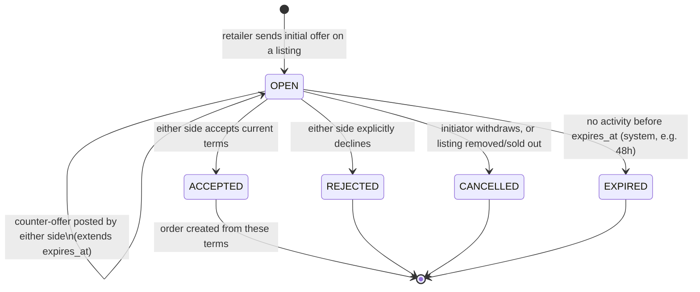

# Negotiation & Order State Machines

Status: **Proposal — awaiting approval**

Both machines are enforced **server-side only** — `orders.status` and `negotiations.status` are never set directly
from client input; every transition goes through a service method that checks the current state, the actor's role,
and any guard conditions, and writes an `order_status_history` row in the same DB transaction as the status change.

## 1. Negotiation lifecycle

A negotiation is one farmer + one retailer discussing terms on one listing. It exists to produce, at most, one
`order`. Only a coarse location is visible during negotiation — see `docs/api-spec.md` on listing/location
visibility; the exact pickup address is not part of a negotiation's payload.

| From | Event | To | Who | Side effects |
|---|---|---|---|---|
| — | Retailer opens negotiation on an active listing | `OPEN` | retailer | `negotiation_offers` row #1; `OfferReceived` event → notify farmer |
| `OPEN` | Counter-offer (price/quantity) | `OPEN` | farmer or retailer | new `negotiation_offers` row; `expires_at` pushed out; notify the other side |
| `OPEN` | Accept current terms | `ACCEPTED` | farmer or retailer (whoever didn't post the last offer) | `final_price_per_unit`/`final_quantity` set; `NegotiationAccepted` event → **creates an `order`** (see below) |
| `OPEN` | Reject | `REJECTED` | farmer or retailer | notify other side |
| `OPEN` | Cancel | `CANCELLED` | the offer's own initiator, or system if listing is removed | notify other side |
| `OPEN` | Expiry sweep | `EXPIRED` | system (scheduled job) | notify both sides |

**Guard:** a listing can have many *concurrent* `OPEN` negotiations with different retailers (first-come pricing
isn't decided by the platform). The moment one negotiation reaches `ACCEPTED` for a quantity that exhausts the
listing, the farmer's remaining open negotiations on that listing are auto-`CANCELLED` with a clear reason
(`listing_sold_out`) rather than left to expire — this is a service-layer rule in `negotiation`, not a raw status
flip.

## 2. Order lifecycle

Created the instant a negotiation is `ACCEPTED`. This is the core trust-and-money state machine.

**Design rule that shapes this diagram**: an order can only be `COMPLETED` once its payout transfer has been
**irreversibly released** at the gateway (see `docs/decisions/ADR-0005-payment-payout-model.md`). Because of
that, `DISPUTED` must always be reachable *before* `COMPLETED` and never after — a dispute raised after
`COMPLETED` would be asking to reverse money that has already, genuinely, left the system's control. The fix
versus an earlier draft of this doc is a **payout hold window**: pickup confirmation does not itself release the
transfer. It starts a hold window (`orders.payout_release_at`); only once that window elapses with no dispute
open does the system release the transfer and move the order to `COMPLETED`. `DISPUTED` is reachable any time up
through that window, and is **not** reachable from `COMPLETED`.

```mermaid
stateDiagram-v2
    [*] --> PENDING_PAYMENT: order created from ACCEPTED negotiation\ncommission computed & snapshotted\nsplit-payment created (transfer to farmer on_hold)
    PENDING_PAYMENT --> PAYMENT_FAILED: gateway reports failure
    PAYMENT_FAILED --> PENDING_PAYMENT: retailer retries payment
    PENDING_PAYMENT --> CANCELLED: payment window expires (e.g. 30 min) or retailer cancels
    PENDING_PAYMENT --> CONFIRMED: payment captured (webhook)\nfarmer's payout transfer now exists, held

    CONFIRMED --> PICKUP_SCHEDULED: pickup date/time agreed
    PICKUP_SCHEDULED --> READY_FOR_PICKUP: farmer marks produce ready\n(pickup handover code generated)
    READY_FOR_PICKUP --> PICKED_UP: retailer confirms handover code\npayout_release_at = now + hold window (e.g. 48h)
    PICKED_UP --> COMPLETED: hold window elapses, no open dispute\ntransfer released to farmer's linked account

    CONFIRMED --> CANCELLED: mutual cancel / admin override (pre-pickup)\ntransfer cancelled, payment refunded
    PICKUP_SCHEDULED --> CANCELLED: mutual cancel / admin override (pre-pickup)\ntransfer cancelled, payment refunded

    CONFIRMED --> DISPUTED: dispute raised
    PICKUP_SCHEDULED --> DISPUTED: dispute raised
    READY_FOR_PICKUP --> DISPUTED: no-show past pickup deadline (system) or dispute raised
    PICKED_UP --> DISPUTED: dispute raised (only reachable before payout_release_at)

    DISPUTED --> RESOLVED_RESUME: admin resolves — no action, resume flow
    DISPUTED --> REFUNDED: admin resolves — full refund; transfer reversed, payment refunded
    DISPUTED --> PARTIALLY_REFUNDED: admin resolves — partial refund; transfer reduced, payment partially refunded

    RESOLVED_RESUME --> READY_FOR_PICKUP: if dispute was raised pre-pickup
    RESOLVED_RESUME --> PICKED_UP: if dispute was raised post-pickup, pre-release\n(payout_release_at recomputed from resolution time)
    PARTIALLY_REFUNDED --> COMPLETED: reduced transfer released once its own hold window elapses

    CANCELLED --> [*]
    REFUNDED --> [*]
    COMPLETED --> [*]
```

*(`RESOLVED_RESUME` is a transient routing state, not necessarily stored distinctly if that's simpler in
practice — the implementation can instead resume directly to the correct concrete state. Modeled explicitly here
so "which state do we resume to, and does the hold window restart" isn't hand-waved. It does restart: a dispute
found to be unfounded shouldn't shorten the buyer-protection window for a *second* dispute.)*

**`COMPLETED` has no outgoing transitions except terminal.** There is deliberately no post-completion dispute
path in V1 — see the "why no post-completion disputes" note below.

### Transition table

| From | Event | To | Who | Side effects |
|---|---|---|---|---|
| — | Negotiation accepted | `PENDING_PAYMENT` | system | order row created; `commission_rate_snapshot`/`commission_amount`/`payout_amount` computed via `commission` module and frozen; gateway order created with an `on_hold` split transfer for `payout_amount` to the farmer's linked account; `OrderCreated` event |
| `PENDING_PAYMENT` | Gateway webhook: payment failed | `PAYMENT_FAILED` | system (webhook) | notify retailer with retry link |
| `PAYMENT_FAILED` | Retailer retries | `PENDING_PAYMENT` | retailer | new gateway order + held transfer created |
| `PENDING_PAYMENT` | Payment window expires / retailer cancels | `CANCELLED` | system or retailer | held transfer never settles (nothing to reverse); listing quantity released back; notify farmer |
| `PENDING_PAYMENT` | Gateway webhook: payment captured | `CONFIRMED` | system (webhook) | `payments.status = CAPTURED`; `OrderConfirmed` event → notify both sides |
| `CONFIRMED` | Pickup slot agreed | `PICKUP_SCHEDULED` | farmer or retailer (either proposes, other confirms — simple mutual-agreement field, not a sub-workflow) | `pickup_scheduled_at` set; notify both |
| `PICKUP_SCHEDULED` | Farmer marks ready | `READY_FOR_PICKUP` | farmer | system generates a **pickup handover code** (`pickup_handover_codes` — a mechanism entirely separate from login/signup OTP, see below) and sends the plaintext code to the **farmer only**; notify retailer "ready for pickup" |
| `READY_FOR_PICKUP` | Retailer enters the handover code (read aloud by farmer at physical handover) | `PICKED_UP` | retailer | `pickup_confirmed_at` set; `payout_release_at = pickup_confirmed_at + hold window` (default 48h, admin-configurable); `order_status_history` records who confirmed; `PickupConfirmed` event |
| `PICKED_UP` | `payout_release_at` passes, no open dispute | `COMPLETED` | system (scheduled job) | gateway transfer released; `payouts.status = SETTLED`, `released_at` set; `PayoutProcessed` event → notify farmer |
| `CONFIRMED` / `PICKUP_SCHEDULED` | Mutual cancel or admin override | `CANCELLED` | farmer+retailer agreement, or admin | held transfer cancelled (never settled); payment refunded to retailer; reason logged |
| `READY_FOR_PICKUP` | Pickup deadline passes with no `PICKED_UP` | `DISPUTED` (category `NO_SHOW`) | system (scheduled job) | auto-opens a dispute rather than silently cancelling — the transfer is already held, so a human decides whether/how to release, reduce, or reverse it |
| `CONFIRMED`..`PICKED_UP` (before `payout_release_at`) | Either party raises a dispute (within the allowed window) | `DISPUTED` | farmer or retailer | scheduled release job is paused for this order; admin notified |
| `DISPUTED` | Admin resolves: no issue found | back to prior stage (`READY_FOR_PICKUP` if pre-pickup, `PICKED_UP` if post-pickup, with `payout_release_at` recomputed) | admin | resumes normal flow |
| `DISPUTED` | Admin resolves: full refund | `REFUNDED` | admin | held transfer reversed via gateway API (funds never left platform's/gateway's control); payment refunded to retailer |
| `DISPUTED` | Admin resolves: partial refund | `PARTIALLY_REFUNDED` → `COMPLETED` (after its own hold window) | admin | transfer amount reduced via gateway API; payment partially refunded to retailer; reduced transfer still goes through its own hold window before release |

### Why no post-completion disputes

Under this model, `COMPLETED` is defined as "the transfer has been released" — an action we deliberately can't
undo through the gateway (that's what makes the trust guarantee meaningful in the other direction: a farmer who
reaches `COMPLETED` has a real, final payout, not a conditional one forever). So V1 does not model a
post-completion dispute/refund path. In exchange, the hold window (default 48h from pickup confirmation) is the
real dispute deadline, and it needs to be long enough that this is rarely a problem in practice — the hold
window length is admin-configurable specifically so it can be tuned from real data. A genuinely late-discovered
issue after `COMPLETED` is a support/goodwill matter handled outside this state machine (e.g. a manual credit on
a future order), not a system-modeled refund — this is a deliberate V1 limitation, not an oversight.

### Notes

- **Commission is frozen at `PENDING_PAYMENT` creation**, not at `COMPLETED`. This means a mid-flight change to
  `commission_rules` never affects an order already in progress — the amount printed to the retailer at checkout
  is the amount that's actually charged and settled.
- **The payout transfer is created (on hold) at `PENDING_PAYMENT` and never released before `PICKED_UP` plus the
  full hold window.** This is the core trust guarantee of the marketplace: a retailer who never shows up hasn't
  had a farmer paid for nothing (the held transfer just gets cancelled), and a farmer who confirms pickup has a
  payout that will definitely release unless a dispute is raised within the window — not an indefinite maybe.
- **Cancellation policy (who can cancel when, any penalty) is deliberately left as an admin-configurable rule,
  not hardcoded** — see `docs/decisions/ADR-0004-cancellation-refund-policy.md`. The state machine above supports
  cancellation at any pre-pickup state; the *business rule* for whether that's free, partially penalized, etc.
  is out of scope for V1 and defaults to "admin decides case-by-case."
- **Pickup handover uses a dedicated `pickup_handover_codes` mechanism, not the login/signup OTP system.** They
  share the same *shape* (a short hashed code with an expiry and attempt counter) but are structurally separate:
  different table, different endpoints (`/orders/:id/mark-ready` and `/orders/:id/pickup/confirm`, vs.
  `/auth/otp/request` and `/auth/otp/verify`), and a pickup code is scoped to one specific `order_id` rather than
  a phone number. Verifying a pickup code never issues an auth token or session — it only transitions order
  state. See `docs/erd.md` and `docs/api-spec.md` for the split.
